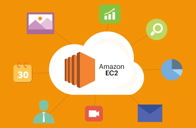

# Host your personal site on AWS EC2 Instance

## 🚀 Project Overview
This project provides a step-by-step guide to setting up AWS infrastructure, including launching an EC2 instance, configuring security, and deploying applications. The setup is ideal for startups and small businesses looking for scalable cloud solutions.


## **Architecture**



# AWS Infrastructure Setup

---

## 📌 Table of Contents
- [Project Overview](#project-overview)
- [Prerequisites](#prerequisites)
- [Step 1: Launch an EC2 Instance](#step-1-launch-an-ec2-instance)
- [Step 2: Configure Security Group](#step-2-configure-security-group)
- [Step 3: Connect to EC2 Instance](#step-3-connect-to-ec2-instance)
- [Step 4: Deploy an Application](#step-4-deploy-an-application)
- [Benefits for Clients](#benefits-for-clients)
- [License](#license)

---

## ✅ Prerequisites
Before starting, ensure you have the following:
- An AWS Free Tier account
- Basic knowledge of Linux and cloud computing
- SSH client (Terminal, PuTTY, etc.)
- AWS CLI installed

---

## 🚀 Step 1: Launch an EC2 Instance
### 🔹 Task 1.1 – Launch an EC2 Virtual Machine
1️⃣ Login to AWS Console → Navigate to **EC2**
2️⃣ Click **Launch Instance**
3️⃣ Choose **Amazon Linux 2** or **Ubuntu 22.04**
4️⃣ Select **Instance Type** (t2.micro for free-tier)
5️⃣ Configure **Security Group**:
   - Allow **SSH (22)** from your IP
   - Allow **HTTP (80)** for web traffic
6️⃣ Click **Launch**, create/download a key pair, and connect via SSH.

✅ **Client Benefit**: Scalable computing for hosting web applications.

---

## 🚀 Step 2: Configure Security Group
### 🔹 Task 2.1 – Modify Security Rules
- **Inbound Rules**: Allow SSH, HTTP, and custom ports as per your app needs.
- **Outbound Rules**: Allow all traffic (default setting).

✅ **Client Benefit**: Secure network access control.

---

## 🚀 Step 3: Connect to EC2 Instance
### 🔹 Task 3.1 – SSH into EC2
1️⃣ Open Terminal / PuTTY
2️⃣ Run:
   ```bash
   ssh -i your-key.pem ec2-user@your-ec2-public-ip
   ```
3️⃣ You are now connected to your cloud server.

✅ **Client Benefit**: Remote server access for development and deployment.

---

## 🚀 Step 4: Deploy an Application
### 🔹 Task 4.1 – Deploy a Simple Web App
1️⃣ Install required software:
   ```bash
   sudo yum update -y
   sudo yum install -y httpd
   ```
2️⃣ Start the web server:
   ```bash
   sudo systemctl start httpd
   ```
3️⃣ Create an index page:
   ```bash
   echo "<h1>Hello from AWS EC2!</h1>" | sudo tee /var/www/html/index.html
   ```
4️⃣ Open your EC2 public IP in a browser.

✅ **Client Benefit**: Deploy websites and APIs efficiently.


## 🎯 Benefits for Clients
- **Cost-Effective**: Uses AWS Free Tier resources.
- **Scalability**: Easily scale based on traffic.
- **Security**: IAM roles and security groups ensure protection.
- **Flexibility**: Can deploy apps, store files, and manage databases efficiently.

---

🚀 **Let’s build scalable cloud solutions together!**

